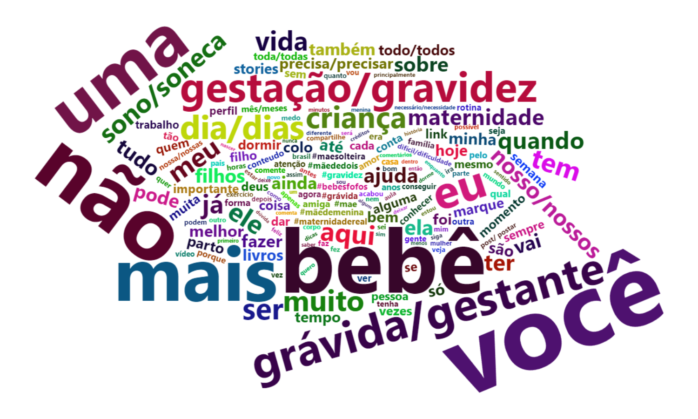
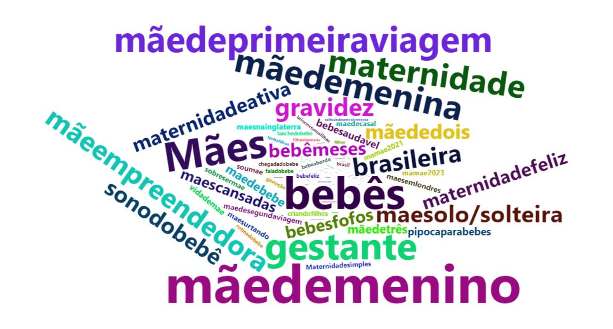

# Repositório FBTC 2024

Este repositório contém dados e *scripts* utilizados no trabalho *"Temáticas sobre gestação disseminadas por influenciadores no Instagram sob a ótica da Self-Determination Theory — um estudo exploratório"*, apresentado no XVI CBTC 2024 (Natal, RN). 

### Autores

Kátia Cristina de Paula
 *Mestranda do PPGP / UFES*
 [kcrispaula@gmail.com](mailto:kcrispaula@gmail.com)

Hugo Cristo Sant'Anna (orientador)
 *Professor colaborador do PPGP / UFES*
 [hugo.santanna@ufes.br](mailto:hugo.santanna@ufes.br)

### Slides
[apresentacao-fbtc-2024.pdf](./slides/apresentacao-fbtc-2024.pdf)

### Sobre o trabalho

Esta apresentação é parte da pesquisa de mestrado de Kátia Cristina de Paula no [Programa de Pós-Graduação em Psicologia (PPGP) da Ufes](https://psicologia.ufes.br/pt-br/pos-graduacao/PPGP) com financimento da CAPES.

---

### Resumo

#### Introdução

O Instagram é uma rede social de compartilhamento instantâneo de fotos e vídeos, marcada pela interação entre pessoas anônimas e influenciadores, que têm milhares de seguidores. Há influenciadores especializados na difusão de conteúdos sobre gestação e maternidade, com foco na motivação, saúde e bem-estar psicológicos das gestantes, objetos de estudo da Self-Determination Theory (SDT).

#### Objetivos

Este estudo mapeou influenciadores do Instagram que disseminam informações sobre a gestação para analisar, na perspectiva da SDT, os conteúdos das publicações e as características das interações com seus seguidores.

#### Métodos

Tratou-se de estudo exploratório desenvolvido em três etapas em outubro de 2023. Um questionário online, direcionado a mulheres brasileiras na primeira gestação e com idade superior a 18 anos, solicitou indicações de perfis de influenciadores que abordem temáticas da gestação. Os perfis indicados foram verificados quanto às temáticas e número de seguidores. Em seguida, os dez perfis com mais seguidores tiveram as últimas 30 publicações capturadas pela ferramenta Apify, acompanhadas dos dez comentários mais recentes e de metadados, como o total de curtidas, de comentários e as palavras-chave empregadas. A base foi então analisada no ambiente R/RStudio, utilizando estatística descritiva e inferencial, além de técnicas de processamento e visualização de dados.

#### Resultados

Um total de 23 gestantes, com idades entre 18 e 40 anos, responderam ao questionário e indicaram 29 perfis. Destes, os dez influenciadores com mais seguidores (199 mil a 2,8 milhões) foram considerados na análise, totalizando 300 publicações que receberam 3,05 milhões de curtidas. A base completa contém 300 comentários e 147 palavras-chave únicas, sendo #mãedemenino (*f*=209), #maternidadereal (180), #bebês (174), #mães (165) e #gestante (148) as mais frequentes. As duas palavras mais utilizadas nas publicações foram “você” (321) e “não” (278). Esta aparece em 93 publicações (31% do total), todas de caráter prescritivo e normativo sobre o que as mães não devem fazer, se preocupar ou se importar.

#### Discussão

As publicações, comentários e palavras-chave abordaram compromissos, dificuldades, demandas, preocupações, rotina da mãe e do bebê, sobrecargas, conciliação de trabalho e maternidade, desabafos, comparações e iniciativas para ajudar outras mães. Finalmente, a análise das correlações significativas entre comentários e curtidas sugere que o alto número de seguidores não é garantia de engajamento das gestantes. Sob a ótica das seis miniteorias que integram a SDT, pode-se discutir como a internalização dessas informações, especialmente as prescrições, afetam os processos de autorregulação das gestantes no que tange às necessidades psicológicas básicas de competência, autonomia e pertencimento durante a gestação.

**Palavras-chaves**: gestação, Instagram, Self-Determination Theory, maternidade, redes sociais

#### Leituras sugeridas (SDT)

Ryan, R. M., & Deci, E. L. (2020). Intrinsic and extrinsic motivation from a self-determination theory perspective: Definitions, theory, practices, and future directions. *Contemporary educational psychology*, 61, 101860. https://doi.org/10.1016/j.cedpsych.2020.101860

Ryan, R. M., & Deci, E. L. (2022). Self-determination theory. In *Encyclopedia of quality of life and well-being research* (pp. 1-7). Cham: Springer International Publishing. https://link.springer.com/referenceworkentry/10.1007/978-3-319-69909-7_2630-2

---

### Reprodução das análises

As análises foram desenvolvidas na [linguagem R](https://cran.r-project.org) e ambiente [RStudio](https://rstudio.com) e podem ser reproduzidas por meio da execução do projeto [analises.Rproj](./analises/analises.Rproj) fornecido na pasta [./analises/](./analises/) deste repositório. A pasta tem a seguinte estrutura:

~~~~
analises
   |
   +---- 01-gera-lista-palavras.R
   |
   +---- 02-nuvem-de-palavras.R
   |
   +---- 03-gera-lista-hashtags.R
   |
   +---- 04-nuvem-hashtags.R
   |
   +---- 05-prescricoes.R
   |
   +---- analises.Rproj
   |
   +---- dados
           |
           +---- banco-completo-anonimo.xlsx
           |
           +---- lista-palavras.xlsx
           |
           +---- lista-hashtags.xlsx

~~~~

Os *scripts* disponíveis na pasta do projeto correspondem às análises do trabalho apresentado. Todas as dependências (pacotes e bases de dados) estão indicadas em cada *script*. Os pacotes [ggplot2](https://ggplot2.tidyverse.org/), [stringr](https://stringr.tidyverse.org/). [readxl](https://readxl.tidyverse.org/) e [wordcloud2](https://cran.r-project.org/web/packages/wordcloud2/vignettes/wordcloud.html) são necessários e podem ser instalados automaticamente seguindo as instruções do RStudio.

#### Dados sobre as bases

A base completa contém 300 comentários e 147 palavras-chave (*hashtags*) únicas, referentes a dez (10) perfils monitorados (30 publicações cada). Os dados foram obtidos por meio da plataforma [Apify](https://apify.com/), considerando os seguintes campos:

|Identificador do campo|Significado|
|----------------------|-----------|
|Id|identificador único da publicação|
|ownerUsername|nome do usuário (p.ex. @influenciador1)|
|ownerFullName|nome de exibição do usuário|
|Caption|conteúdo textual da publicação|
|url|endereço da publicação (link)|
|shortCode|código abreviado da publicação|
|Timestamp|data e hora da publicação|
|likesCount|total de curtidas da publicação|
|commentsCount|total de comentários|
|videoViewCount|visualizações do vídeo|
|videoPlayCount|reproduções do vídeo|
|Mentions|menções|
|Hashtags|hashtags (uma ou mais)|
|firstComment|primeiro comentário|
|latestComments/n/id|comentário n mais recente (máximo: 10)|
|latestComments/n/likesCount|total de curtidas do comentário recente n|
|latestComments/n/ownerUsername|nome do usuário do comentário n|
|latestComments/n/replies/m/id|identificador da resposta m ao comentário n|
|latestComments/n/replies/m/likesCount|total de curtidas da resposta m ao comentário n|
|latestComments/n/replies/m/ownerUsername|nome do usuário autor da resposta m ao comentário n|
|latestComments/n/replies/m/text|texto da resposta m ao comentário n|
|latestComments/n/replies/m/timestamp|data e hora da resposta m ao comentário n|
|videoUrl|endereço do vídeo (link)|

Os *scripts* fornecidos são independentes, podendo ser executados individualmente. Os *scripts* responsáveis pela geração das tabelas de dados (*dataframes*) produzem arquivos CSV que foram importados no Microsoft Excel. Aspectos da limpeza manual realizada são indicados nas seções abaixo e as planilhas disponíveis na pasta [dados](./analises/dados/) contém as versões finais utilizadas nas análises do trabalho apresentado.

|Script R|CSV exportado|XLXS limpo|
|--------|-------------|----------|
|01-gera-lista-palavras.R|lista.palavras.csv|lista.palavras.xls|
|03-gera-lista-hashtags.R|hashtags-unicas.csv|hashtags-unicas.xls|
|05-prescricoes.R|prescricoes.csv|prescricoes.xlsx|

#### Nuvens de palavras
A planilha [lista-palavras.xlsx](./analises/dados/lista-palavras.xlsx) contém os termos extraídos das publicações (*posts*) do banco [banco-completo-anonimo.xlsx](./analises/dados/banco-completo-anonimo.xlsx).
As duas palavras mais utilizada no texto das publicações foram “você” (321) e “não” (278), seguidas por “bebê” (321). Após a mineração automática, a planilha gerada (*n*=4445 termos) foi limpa manualmente no Microsoft Excel, de modo a identificar eventuais termos não removidos, combinar termos com radicais comuns e padronizar gênero e número.

Atenção ao executar o *script* [01-gera-lista-palavras.R](./analises/01-gera-lista-palavras.R), pois o processamento é demorado (4445 termos x 300 *posts*).

As palavras-chave mais frequentes são #mãedemenino (*f*=209), #maternidadereal (180), #bebês (174), #mães (165) e #gestante (148) as mais frequentes. A extração dessas palavras-chave está descrita no *script* [03-gera-lista-hashtags.R](./analises/03-gera-lista-hashtags.R).

A planilha [lista-hashtags.xlsx](lista-hashtags.xlsx) contém as palavras-chave extraídas de [banco-completo-anonimo.xlsx](./analises/dados/banco-completo-anonimo.xlsx) e suas respectivas frequências, após limpeza manual no Microsoft Excel (padronização de radicais, gênero e número dos termos) e remoção do sinal "tralha" (#).

#### Prescrições

A partir da identificação da alta ocorrência do termo “não” (278), procedeu-se à criação de um *script* que extrai o termo acompanhado de mais quatro (4) palavras, permitindo a análise do contexto mais amplo em que ocorreram.

#### Comentários e curtidas

Por fim, nenhuma relação foi encontrada na análise das diferenças observadas nos comentários, considerando as diferenças observadas nas curtidas. Os coeficientes de correlação apontam situações de muita interação entre influenciadores e seguidores, enquanto em outras os seguidores curtem as publicações sem fazer comentários. 

Estes achados têm implicações para os cálculos mais tradicionais de influência, em que o índice é apurado a partir da razão entre o total de comentários e curtidas e o número de seguidores. Dependendo da temática da publicação, as gestantes parecem satisfeitas em consumir o conteúdo sem interagir com seu autor. 

---

### Licença

Este repositório é distribuído pela licença [CC0 1.0 Universal](https://creativecommons.org/publicdomain/zero/1.0/deed.pt).